# mybatis-friend


[](https://github.com/alansun2/mapper-generator-javafx/releases)

> 这是一个由 `JavaFX`, `Spring`, `FreeMarker`开发的小工具, 可以快速生成数据库对应的**实体类**、**Mybatis Mapper**、**模板(
Controller, Service, DTO等)**, 使您有更多的时间去摸鱼🤩。

> 如果在使用中发现问题或觉得有优化的地方, 欢迎大家提 issue, Thanks！😄
>
> 如果觉得还错的话, 欢迎大家点个 star, 👍！

## 1. 主要功能概览

1. 可视化生成数据库相应的实体类, 不需要再写繁琐的配置文件
2. 支持自定义模板, 快速生成重复代码, 例如: `Controller`, `Service`, `DTO` 等
3. 支持包路径占位符替换
4. 支持领域模型(`Domain`)的占位符替换
5. 支持 `java` 文件合并, 再也不用担心文件被覆盖
6. 支持外部 `mybatis-generator` 插件导入
7. 记录您每一次的变动
    - 这里讲一下自身使用官方的 `mybatis-generator` 感受, 当我有多个数据源时, 刚开始我在`数据源1`工作, 生成`OrderInfo`
      , `OrderInfoMapper`, `OrderInfoMapper.xml`三个文件（忽略了一些字段, 去除了delete update sql）, 接着我又在`数据源2`
      工作, 此时我已经把`数据源1`的配置删除, 后来我对`数据源1`的`order_info`表回复一些之前忽略的字段, 或者我要去除一个
      count sql方法, 这时我又要重新配置`数据源1`, 并且要比对之前生成的文件, 很是麻烦。也许你会说, 使用多个配置文件来回切换就可以。
      当然这也是一种方法。不过我相信当你用了`mybatis-friend`, 你应该会抛弃这种想法。

## 2. 版本日志

* v4.0.0
    1. 重构代码, 优化UI
    2. 新增了模板功能
    3. 新增导入导出配置的功能
    4. 包名支持占位符替换
    5. 新增 `java` 文件 merge 功能, 暂不支持 `kotlin` 的 merge
    6. 新增领域包功能
    7. 新增外部 `mybatis-generator` 插件导入功能
    8. 删除了 tk.mybatis 的生成策略
* v2.1.0
    1. 增加 tk.mybatis 的生成策略
    2. 增加 mybatis 生成策略（MyBatis3Simple, MyBatis3DynamicSql）
    3. 优化代码
* v2.0.0
    1. 增加可选择的实现 Serializable 接口的功能
    2. 重构代码
    3. 优化搜索
    4. 修改一些bug
* v1.1.0
    1. 增加表搜索功能, 左边列表区域使用键盘输入就可以使用

## 3. 使用

### 3.1. 添加数据源

1. 右上角菜单栏点击文件 -> 添加数据源
   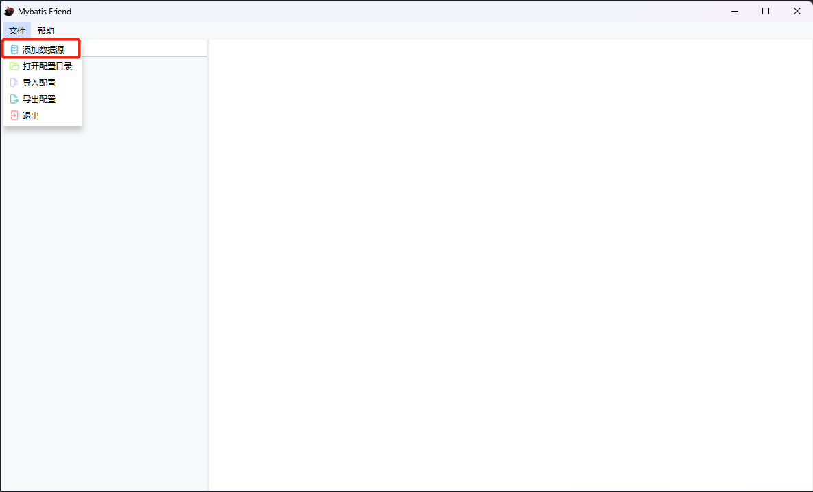
   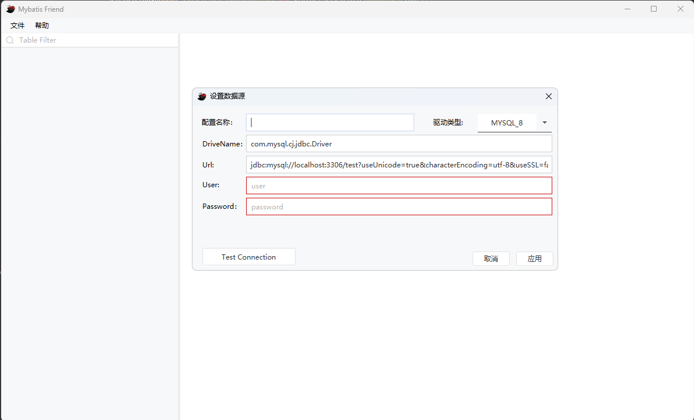

> 说明:
> 1. 理论上可以支持所有数据库, 但经过本人测试的只有 `mysql`。如果您使用时发现有问题的话, 可以在 `github` 或 `gitee` 提
     issue
> 2. 新增时默认选择驱动类型为 `mysql`, 请自行修改配置, 驱动类型下拉框只是为了方便您的填写, 并不会影响配置

### 3.2. 选择需要导出的表

有两种方式:

1. 点击数据源导出会导出数据源下所有表, 另外数据源的刷新只是对表重新加载,
   并不会对字段重新加载。对字段的重新加载请看[3.3. 刷新字段](#33-对需要导出的表进行配置)。
   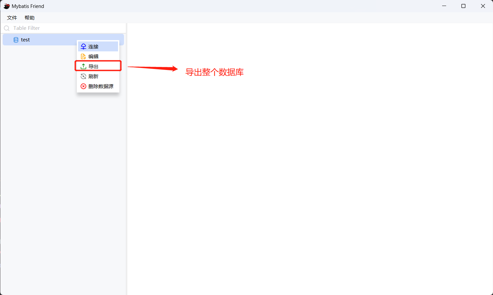

2. 点击表导出(可多选), 或者双击单表导出
   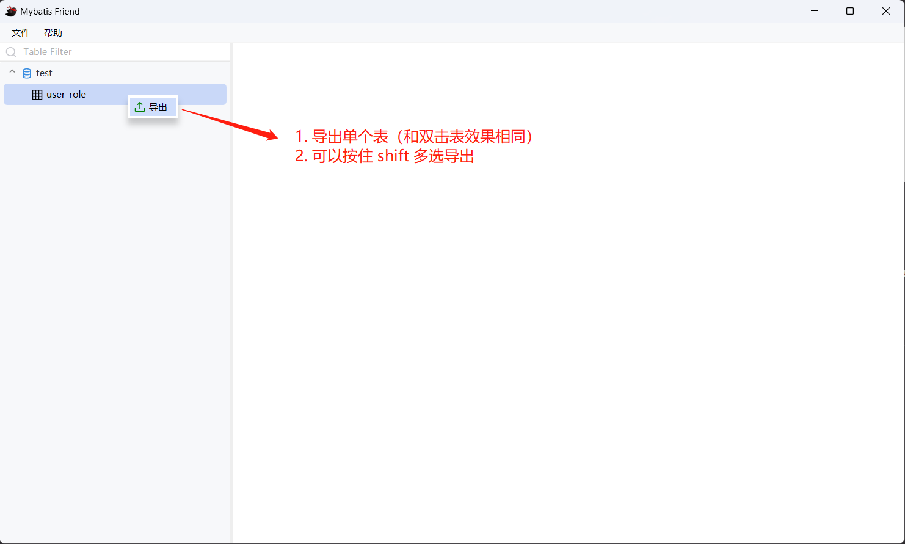

### 3.3. 对需要导出的表进行配置

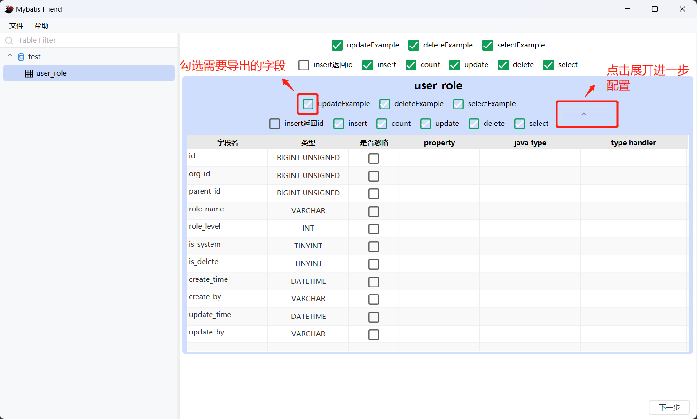
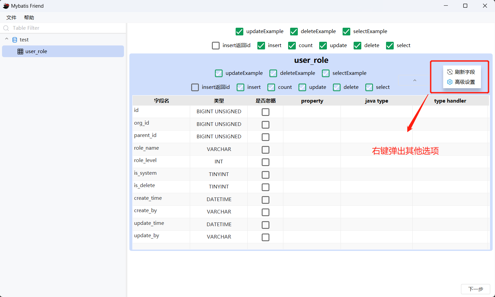
> 说明:
> 1. 表配置, 对想要导出的 sql 语句打上勾
> 2. 表字段配置, 可以忽略导出字段, 指定导出的属性名(property), 对属性名的类型进行重写(java type), 对属性配置类型处理器（type
     handler）

### 3.4. 配置导出配置

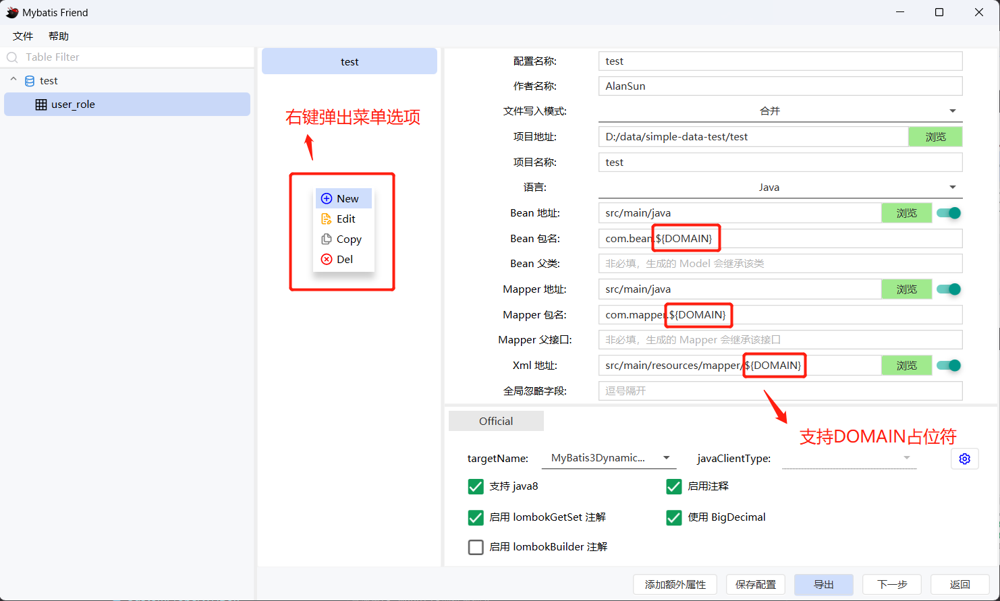

> 说明:
> 1. 这里配置基本都是基于 `mybatis-generator`
     的配置, 配置详情请见[官网](https://mybatis.org/generator/configreference/xmlconfig.html)
> 2. 这里 `Bean 包名`, `Mapper 包名`, `Xml 地址`, 可以使用占位符, 具体请见 [占位符](#81-占位符)

#### 3.4.1. 菜单按钮说明:

1. `添加额外属性`: 可以添加额外的属性, 在 `Bean 包名`, `Mapper 包名`, `Xml 地址` 中使用 `${}` 占位符来引用,
   具体请见 [占位符](#81-占位符)
2. `保存配置`: 当添加新配置后, 配置不会立刻保存至文件, 点击此按钮可以保存配置(另外点击导出也会立刻保存)
3. `导出`: 导出配置
4. `下一步`: 当需要使用模板来快速生成代码时, 可以点击此按钮进行进一步的配置

#### 3.4.2. 高级配置
目前高级配置只支持 mybatis-generator 插件配置, 支持 .java 后缀文件和 jar 包导入。

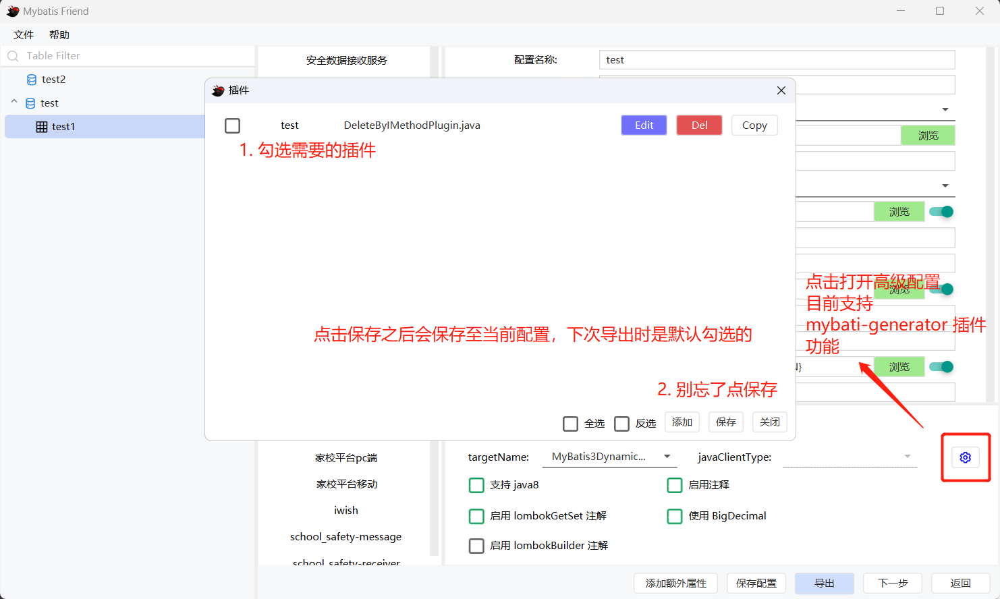
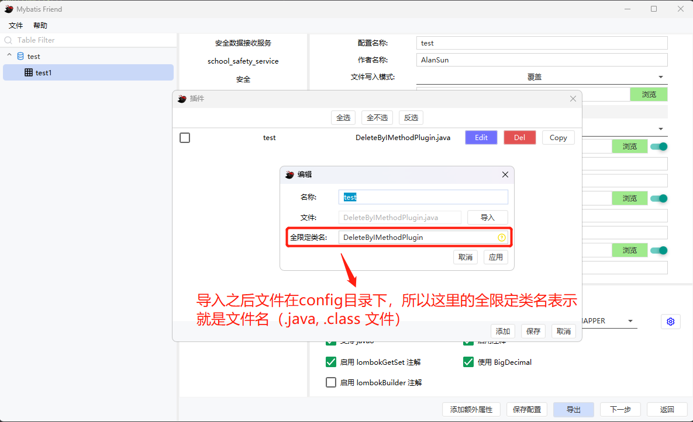

### 3.5. 配置额外模板（可选）

1. 额外模板可以用来快速生成重复代码, 例如: `Controller`, `Service`, `DTO` 等。 如果您不需要该功能, 可以在上一步点击导出即可。
   
   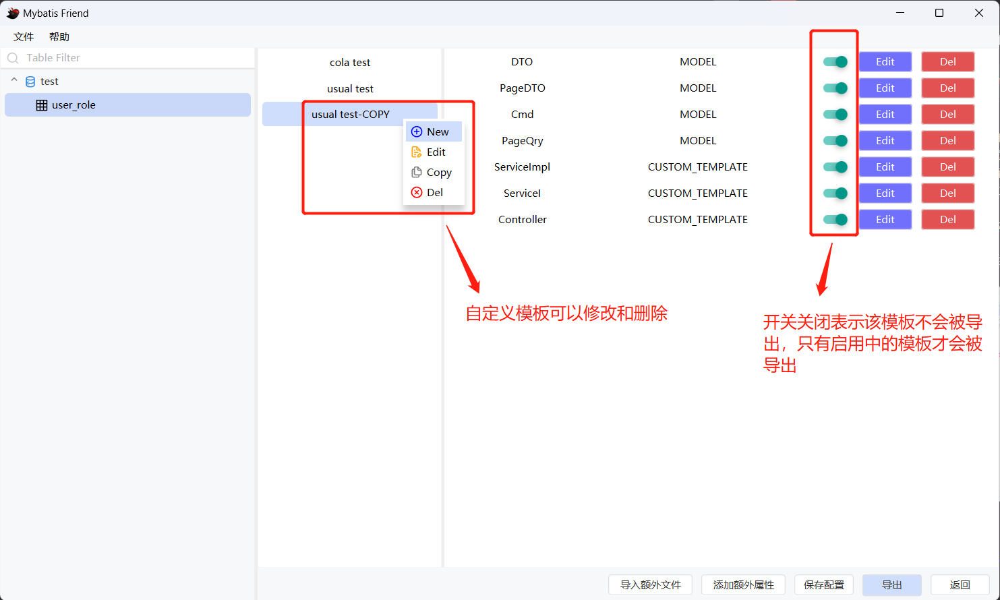

#### 3.5.1. 示例模板说明:

1. `colo test`: 表示 cola 架构, 如果你的项目使用的是 [cola](https://github.com/alibaba/COLA) 架构, 可以使用该模板
2. `usual test`: 通用的分层架构

#### 3.5.2. 按钮说明:

1. `添加额外属性`和`保存配置`同上
2. `导入额外模板`: 从[模板库](#355-配置模板库)中导入到当前配置中
3. `导出`: 导出配置(包括模板文件和 mybatis 文件)
4. `返回`: 返回上一步

#### 3.5.3. 导入额外模板说明

模板是从模板库中导入的, 如何导入请见[模板库](#355-配置模板库)

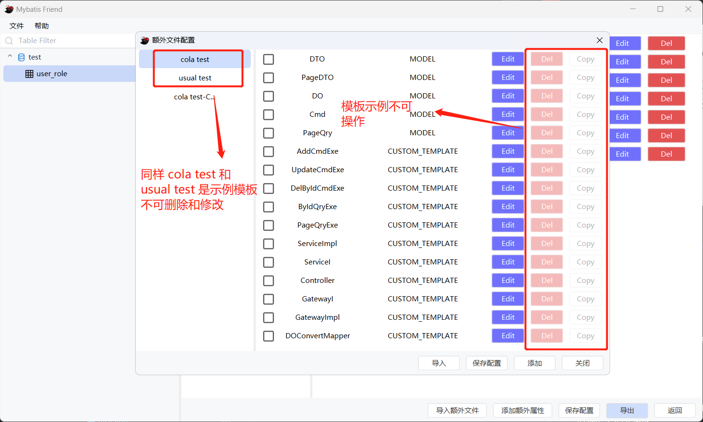

#### 3.5.4. 配置模板

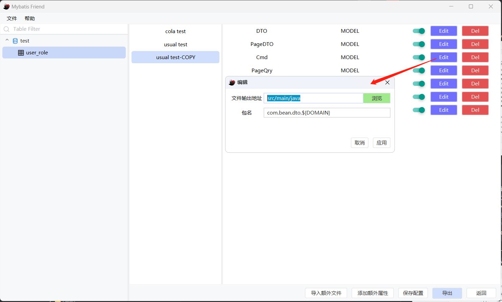

> 配置说明:
> 1. `文件输出地址`: 这里只需要填写相对位置即可, 例如: `src/main/java`, `XXXX/src/main/java`,
     前缀路径由上一步中的`项目地址/项目名称/`组成
> 2. `包名`: 例如: `com.example.demo`, 这里包名支持使用 `${}` 占位符, 例如: `com.example.{a}`, 另外也支持`DOMAIN`,
     具体请见 [占位符](#81-占位符)

#### 3.5.5. 配置模板库

1. 新增 model 模板, model 模板表示 java bean 的模板, 例如: `DTO`。
   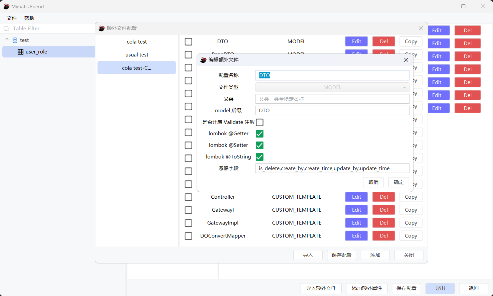

> 配置属性说明:
> 1. `后缀`: 会添加到数据表表名后面, 例如: `order_info` 表, 后缀为 `Model`, 则生成的 bean 名称为 `OrderInfoModel`
> 2. `Validate 注解`: 表示生成 model 时会根据数据库字段的类型添加相应的注解, 例如: `varchar` 类型会添加 `@Length` 注解
> 3. `忽略字段`: 表示生成 model 时会忽略的字段, 例如: `id` 字段
> 4. `父类`: 表示生成 model 时 model 继承父类, 例如: `BaseModel`

2. 新增自定义模板(CUSTOM TEMPLATE), 自定义模板表示类似 Service 层的模板, 例如: `OrderService`, `OrderServiceImpl`, 需要您手写
   FreeMarker 文件并导入
   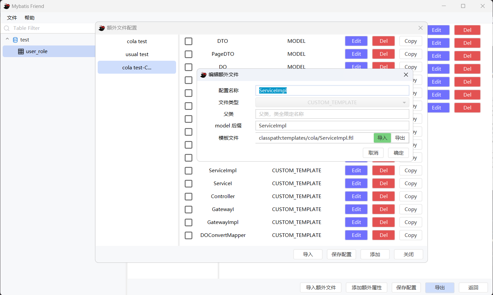

> 自定义模板使用了 [FreeMarker](https://freemarker.apache.org/docs/index.html) 模板引擎

> 配置属性说明:
> 1. `后缀` `父类` 同上
> 2. `模板文件`: 表示模板文件的路径, 例如: `D:/template/OrderService.java.ftl`

##### 3.5.5.1. 按钮说明:

1. `保存配置`: 保存当前配置, 如果添加后不保存直接关闭会丢失配置
2. `导入`: 导入勾选后的模板至当前配置

## 4. 配置和数据存储目录

- `数据目录`: 当前用户下 `/AppData/Local/MapperGeneratorV2/data`
    - `data` 目录下主要存放的是数据表和字段的缓存
- `导出配置`: 当前用户下 `/AppData/Local/MapperGeneratorV2/config`
    - `config` 目录下主要存放的是数据源配置, 导出配置, 插件配置

---

**如果工具发生错误, 可以试一下清空以上目录。如果还不行, 欢迎提 issue。😡**

---

## 5. 日志文件位置

* `windows-exe 版本`: 安装目录下 `mybatis-friend.log`
* `jar 包版本`: jar的同级目录下 `mybatis-friend.log`

## 6. 如何自定义开发自己的功能?

该项目大概8000多行代码, 很简单的代码。但您得先有`JavaFX`,
的基础, 如果您不熟悉 `JavaFX`
这里给 [B 站的可爱阿婆主《JavaFX没人看系列》](https://space.bilibili.com/5096022/video?tid=36&page=8&keyword=&order=pubdate)
做一波广告😄。

### 6.1 构建

该项目使用 [JavaPackager](https://github.com/fvarrui/JavaPackager) 打包, 使用 maven 构建, 使用 jdk17, 如果您想自己构建,
可以按照以下步骤：

1. 执行``` mvn clean package```。目前 pom 中的配置只可以打包成 win, 如果要打包成其他平台,
   请根据 [JavaPackager](https://github.com/fvarrui/JavaPackager)  在 pom 中修改
2. 在 [mapper-generator-javafx-core](mapper-generator-javafx-core)/target/mybatis-friend 目录下找到 `mybatis-friend.exe`
   , 双击即可运行

## 7. 下载

* `mybatis-friend-windows-exe.7z`：可以直接运行在 `windows`
* `mybatis-friend-executable.jar`：可执行 `jar` 包, 可以运行在 `windows`, `linux`, `mac` 等系统,
  命令：`java -jar mybatis-friend-executable.jar`

> 本项目 github 源码地址：https://github.com/alansun2/mapper-generator-javafx
>
> 本项目 gitee 源码地址：https://gitee.com/alansc/mapper-generator-javafx
>
> 本项目 github [下载地址](https://github.com/alansun2/mapper-generator-javafx/releases)
>
> 本项目 gitee [下载地址](https://gitee.com/alansc/mapper-generator-javafx/releases)

## 8. 其他

### 8.1. 占位符

#### 8.1.1. 哪些地方可以使用占位符?

占位符总体来说可以使用在两个地方:

1. 配置, 具体请见如下图:
   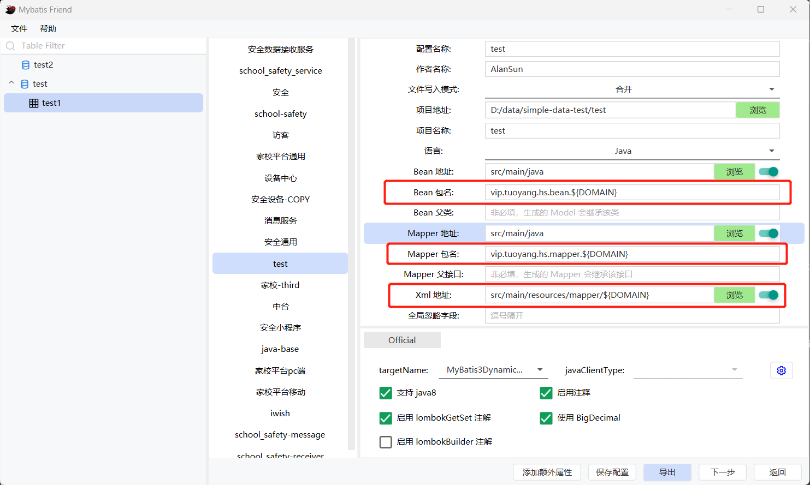
   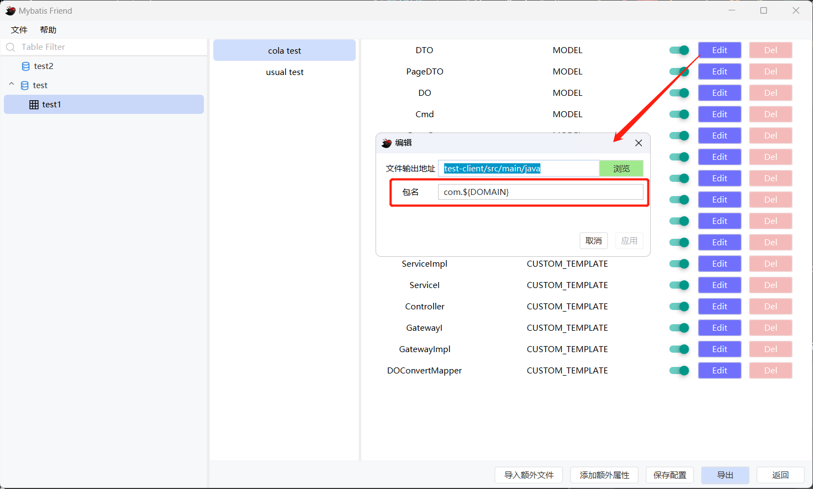
2. FreeMarker 模板, 具体请见如下图:
   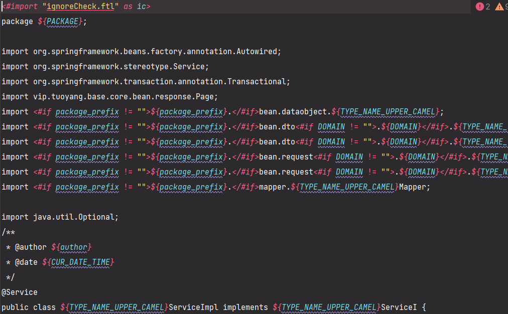

#### 8.1.2. 占位符格式

```
${placeHolder}
```

> **注意**： 不要使用内置的占位符, 内置占位符表请见 [内置占位符](#813-内置占位符)

### 8.1.3. 内置占位符

| 占位符                    | 说明                                        | 类型                         | 可使用的位置 |
|------------------------|-------------------------------------------|----------------------------|--------|
| DOMAIN                 | 领域, 具体请见[8.1.1.](#822-DOMAIN-可以在哪些位置使用)   | String                     | 配置, 模板 |
| DOMAIN_DESC            | 领域描述, 具体请见[8.1.1.](#822-DOMAIN-可以在哪些位置使用) | String                     | 配置, 模板 |
| PACKAGE                | 包名                                        | String                     | 模板     |
| TYPE_NAME_UPPER_CAMEL  | 首字母大写驼峰格式的类名                              | String                     | 模板     |
| TYPE_NAME_LOWER_CAMEL  | 首字母小写驼峰格式的类名                              | String                     | 模板     |
| TYPE_NAME_LOWER_HYPHEN | 中划线分割小写格式的类名                              | String                     | 模板     |
| CUR_DATE_TIME          | 当前时间                                      | String                     | 模板     |
| FIELDS_UPPER_CAMELS    | 首字母大写的字段 list                             | List \<String>             | 模板     |
| IGNORE_FIELDS_MAP      | 被忽略的字段 map                                | Map<String, List\<String>> | 模板     |
| author                 | 作者, 来源 [3.4.](#34-配置导出配置)中的作者名称           | String                     | 模板     |

### 8.2. DOMAIN 说明

#### 8.2.1. 为什么要有 DOMAIN?

您可能会遇到这样的情况, 比如您的原始项目结构是这样的:

```
com
└── test
    └── dao
```

而您想要生成这样的项目结构:

```
com
└── test
    └── dao
        ├── order
        │   ├── Order.java
        │   └── OrderMapper.java
        └── user
            ├── User.java
            └── UserMapper.java
```

可以看到, `dao` 下面多了 `order` 和 `user` 文件夹。原始的 mybatis-generator 是不支持一次性生成这样的项目结构的
(虽然您可以通过修改配置文件的方式一个个的生成, 但还是非常繁琐, 有时还会忘记), 所以这就是为什么要有 `Domain` 的原因。

#### 8.2.2. DOMAIN 可以在哪些位置使用?

其实可以把 `DOMAIN` 当作普通的占位符, 所以能使用占位符的地方都可以使用 DOMAIN。具体请见[占位符](#81-占位符)

#### 8.2.3. 那么问题来了, `DOMAIN` 从哪里来呢?

`DOMAIN` 是从数据表中的备注获取的, 所以想要使用 `DOMAIN`, 备注需要符合一定的格式, 格式为 json, 具体如下:

```json
{
  "d": "order",
  "dd": "订单"
}
```

> 说明:
> 1. `d`: 领域, 使用位置请见[8.2.2.](#822-domain-可以在哪些位置使用), 占位符名称为 `DOMAIN`
> 2. `dd`: 领域描述, 使用位置为模板, 占位符名称为 `DOMAIN_DESC`
> 3. 具体如何使用请见[占位符](#81-占位符)

