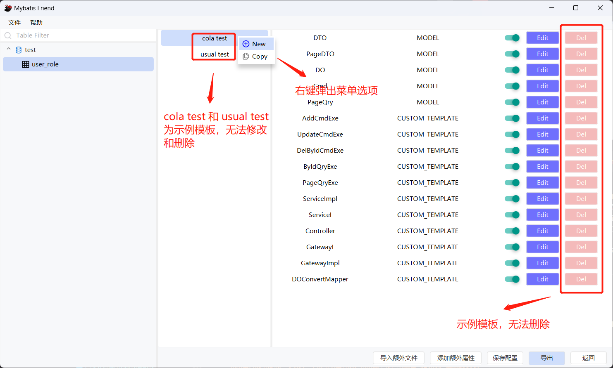
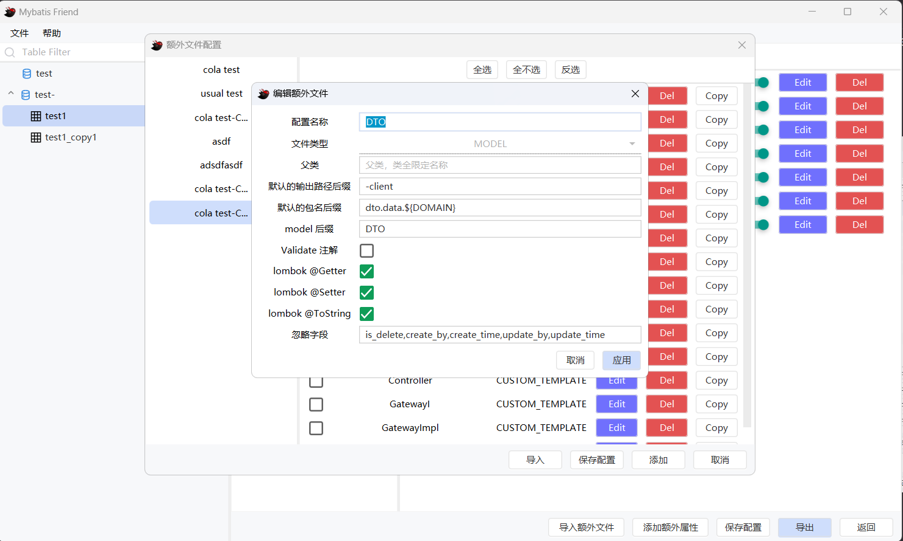
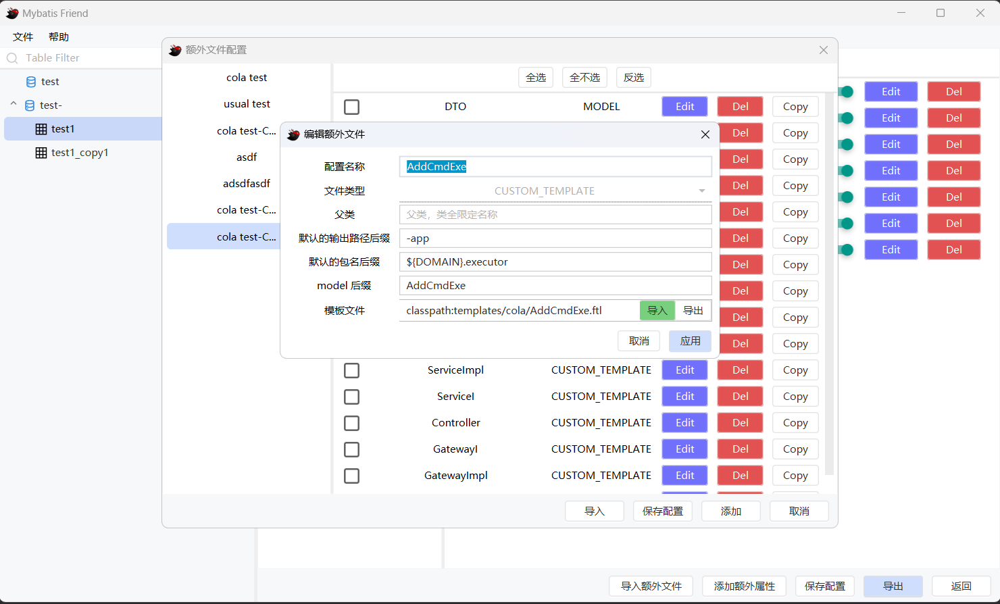

# mybatis-friend


[](https://github.com/alansun2/mapper-generator-javafx/releases)

> 这是一个由 `JavaFX`, `Spring`, `FreeMarker`开发的小工具, 可以快速生成数据库对应的**实体类**、**Mybatis Mapper**、*模板*。
> 如果使用中发现问题或觉得有优化的地方，欢迎大家提 issue，谢谢！

## 1. 主要功能概览

1. 可视化生成数据库相应的实体类，不用再写配置文件
2. 记录你每一次的变动
    - 这里讲一下自身使用官方的 `mybatis-generator` 感受，当我有多个数据源时，刚开始我在`数据源1`工作，生成`OrderInfo`
      ，`OrderInfoMapper`，`OrderInfoMapper.xml`三个文件（忽略了一些字段，去除了delete update sql），接着我又在`数据源2`
      工作，此时我已经把`数据源1`的配置删除，后来我对`数据源1`的`order_info`表回复一些之前忽略的字段，或者我要去除一个
      count sql方法，这时我又要重新配置`数据源1`，并且要比对之前生成的文件，很是麻烦。也许你会说，使用多个配置文件来回切换就可以。
      当然这也是一种方法。不过我相信当你用了`mybatis-friend`，你应该会抛弃这种想法。
3. 自定义模板，快速生成重复代码
4. 支持包路径占位符替换

## 2. 版本日志

* v4.0.0
    1. 重构代码，优化UI
    2. 新增了模板功能
    3. 新增导入导出配置的功能
    4. 包名支持占位符替换
    5. 删除了 tk.mybatis 的生成策略
* v2.1.0
    1. 增加 tk.mybatis 的生成策略
    2. 增加 mybatis 生成策略（MyBatis3Simple，MyBatis3DynamicSql）
    3. 优化代码
* v2.0.0
    1. 增加可选择的实现 Serializable 接口的功能
    2. 重构代码
    3. 优化搜索
    4. 修改一些bug
* v1.1.0
    1. 增加表搜索功能，左边列表区域使用键盘输入就可以使用

## 3. 使用

### 3.1. 添加数据源

1. 右上角菜单栏点击文件 -> 添加数据源
   
   

> 说明:
> 1. 理论上可以支持所有数据库，但经过本人测试的只有 `mysql`。如果您使用时发现有问题的话，可以在 `github` 或 `gitee` 提
     issue
> 2. 新增时默认选择 `mysql`, 请自行修改配置

### 3.2. 选择需要导出的表

有两种方式:

1. 点击数据源导出会导出数据源下所有表，数据源的刷新只是对表重新加载，并不会对字段重新加载。对字段的重新加载请看第三点。
   

2. 点击表导出(可多选)，或者双击单表导出
   

### 3.3. 对需要导出的表进行配置


> 说明:
> 1. 表配置，对想要导出的 sql 语句打上勾
> 2. 表字段配置，可以忽略导出字段，指定导出的属性名(property)，对属性名的类型进行重写(java type)，对属性配置类型处理器（type
     handler）

### 3.4. 配置导出配置


> 说明:
> 1. 这里配置基本都是基于 `mybatis-generator`
     的配置，配置详情请见[官网](https://mybatis.org/generator/configreference/xmlconfig.html)
> 2. DOMAIN 说明请见[8.1.](#81-domain-说明)

#### 3.4.1. 菜单按钮说明:

1. `添加额外属性`: 可以添加额外的属性, 在 `Bean 包名`, `Mapper 包名`, `Xml 地址` 中使用 `{}` 占位符来引用
2. `保存配置`: 当添加新配置后, 配置不会立刻保存至文件, 点击此按钮可以保存配置(另外点击导出也会立刻保存)
3. `导出`: 导出配置
4. `下一步`: 当需要使用模板来快速生成代码时, 可以点击此按钮进行进一步的配置

### 3.5. 配置额外模板（可选）

1. 额外模板可以用来快速生成重复代码, 例如 `增, 删, 改, 查`。 如果您不需要该功能, 可以在上一步点击导出即可。
   
   

#### 3.5.1. 示例模板说明:

1. colo test: 表示 cola 架构, 如果你的项目使用的是 [cola](https://github.com/alibaba/COLA) 架构, 可以使用该模板
2. usual test: 通用的分层架构

#### 3.5.2. 按钮说明:

1. `添加额外属性`和`保存配置`同上
2. `导入额外模板`: 从模板库([3.5.4.](#354-配置模板库))中导入到当前配置中
3. `导出`: 导出配置(包括模板和 mybatis 文件)
4. `返回`: 返回上一步

#### 3.5.3. 导入额外模板说明

> 您可以把额外模板当作时模板库, 你可以把你的模板保存到模板库中, 也可以从模板库中导入模板到当前配置中。
> 模板库中的模板是全局的。模板可以分为两种类型: model 模板和自定义模板(CUSTOM TEMPLATE)。


#### 3.5.4. 配置模板库


> 配置说明:
> 1. `文件输出地址`: 这里只需要填写相对位置即可, 例如: `src/main/java`, `XXXX/src/main/java`,
     前缀路径由上一步中的`项目地址/项目名称/`组成
> 2. 包名: 例如: `com.example.demo`, 这里包名支持使用 `{}` 占位符, 例如: `com.example.{a}`, 运行时会从`额外属性`
     中获取。另外也支持 `DOMAIN`, 详情请见[8.1.](#81-domain-说明)

#### 3.5.5. 新增全局额外模板

1. 新增 model 模板, model 模板表示 java bean 的模板。
   

> 配置属性说明:
> 1. `后缀`会添加到数据表表名后面, 例如: `order_info` 表, 后缀为 `Model`, 则生成的 bean 名称为 `OrderInfoModel`
> 2. `Validate 注解`表示生成 model 时会根据数据库字段的类型添加相应的注解, 例如: `varchar` 类型会添加 `@Length` 注解
> 3. `忽略字段`表示生成 model 时会忽略的字段, 例如: `id` 字段
> 4. `父类`表示生成 model 时 model 继承父类, 例如: `BaseModel`

2. 新增自定义模板(CUSTOM TEMPLATE), 自定义模板表示类似 Service 层的模板, 例如: `OrderService`, `OrderServiceImpl`
   

> 自定义模板使用了 [FreeMarker](https://freemarker.apache.org/docs/index.html) 模板引擎

> 配置属性说明:
> 1. `后缀` `父类` 同上
> 2. `模板文件`表示模板文件的路径, 例如: `D:/template/OrderService.java.ftl`

##### 3.5.5.1. 按钮说明:

1. `保存配置`: 保存当前配置, 如果添加后不保存直接关闭会丢失配置
2. `导入`: 导入勾选后的额外模板至当前配置

## 4. 配置和数据存储目录

- 数据目录放在当前用户的 `/AppData/Local/MapperGeneratorV2/data`
    - `data` 目录下主要是数据表和字段的缓存
- 导出配置存放在当前用户的 `/AppData/Local/MapperGeneratorV2/config`
    - `config` 目录下主要是数据源配置

---

**如果工具发生错误，可以试一下清空以上目录。如果还不行，欢迎在 github 上题issue。**

---

## 5. 日志文件位置

* windows-exe 版本: 安装目录下 `app/mybatis-friend.log`
* jar 包版本：jar的同级目录`mybatis-friend.log`

## 6. 如何自定义开发自己的功能？

该项目大概8000多行代码，很简单的代码。但您事先得有`JavaFX`
的基础，如果您不熟悉 `JavaFX`
这里给 [B 站的可爱阿婆主《JavaFX没人看系列》](https://space.bilibili.com/5096022/video?tid=36&page=8&keyword=&order=pubdate)
做一波广告（哈哈哈）。

### 6.1 构建

该项目使用 [JavaPackager](https://github.com/fvarrui/JavaPackager) 打包，使用 maven 构建，使用 jdk17，如果您想自己构建，可以按照以下步骤：

1. 执行```mvn clean package```
2. 在 [mapper-generator-javafx-core](mapper-generator-javafx-core)/target/mybatis-friend 目录下找到 `mybatis-friend.exe`
   ，双击即可运行

## 7. 下载

* `mybatis-friend-windows-exe.7z`：可以直接运行在 `windows`
* `mybatis-friend-executable.jar`：可执行 `jar` 包, 可以运行在 `windows`, `linux`, `mac` 等系统,
  命令：`java -jar mybatis-friend-executable.jar`

> 本项目 github 源码地址：https://github.com/alansun2/mapper-generator-javafx
>
> 本项目 gitee 源码地址：https://gitee.com/alansc/mapper-generator-javafx
>
> 本项目 github [下载地址](https://github.com/alansun2/mapper-generator-javafx/releases)
>
> 本项目 gitee [下载地址](https://gitee.com/alansc/mapper-generator-javafx/releases)

## 8. 其他

### 8.1. DOMAIN 说明

#### 8.1.1. DOMAIN 用于两个地方:

1. 配置中的占位符替换, 格式为`{DOMAIN}`
    1. 例如: `com.example.demo.{DOMAIN}`, DOMAIN = 'order', 最终的包名会是 `com.example.demo.order`。
2. 自定义模板中的占位符替换, 具体请看 `FreeMarker`

#### 8.1.2. 那么问题来了, `DOMAIN` 从哪里来呢？

`DOMAIN` 是从数据表的备注获取的, 所以想要使用 `DOMAIN`, 备注需要符合一定的格式, 格式为 json, 如下:

```json
{
  "d": "order",
  "dd": "订单"
}
```

> 说明:
> 1. `d`: 领域, 作用请见[8.1.1.](#811-domain-用于两个地方)
> 2. `dd`: 领域描述, 可以在模板中使用, 具体使用参考 `FreeMarker`

### 8.2. 模板内可以使用的占位符

如果您需要自定义模板, 可以使用以下占位符:

| 占位符                    | 说明                                     | 类型                         |
|------------------------|----------------------------------------|----------------------------|
| DOMAIN                 | 领域, 具体请见[8.1.1.](#811-domain-用于两个地方)   | String                     |
| DOMAIN_DESC            | 领域描述, 具体请见[8.1.1.](#811-domain-用于两个地方) | String                     |
| PACKAGE                | 包名                                     | String                     |
| TYPE_NAME_UPPER_CAMEL  | 首字母大写驼峰格式的类名                           | String                     |
| TYPE_NAME_LOWER_CAMEL  | 首字母小写驼峰格式的类名                           | String                     |
| TYPE_NAME_LOWER_HYPHEN | 中划线分割小写格式的类名                           | String                     |
| CUR_DATE_TIME          | 当前时间                                   | String                     |
| FIELDS_UPPER_CAMELS    | 首字母大写的字段 list                          | List \<String>             |
| IGNORE_FIELDS_MAP      | 被忽略的字段 map                             | Map<String, List\<String>> |
| author                 | 作者, 来源 [3.4.](#34-配置导出配置)中的作者名称        | String                     |